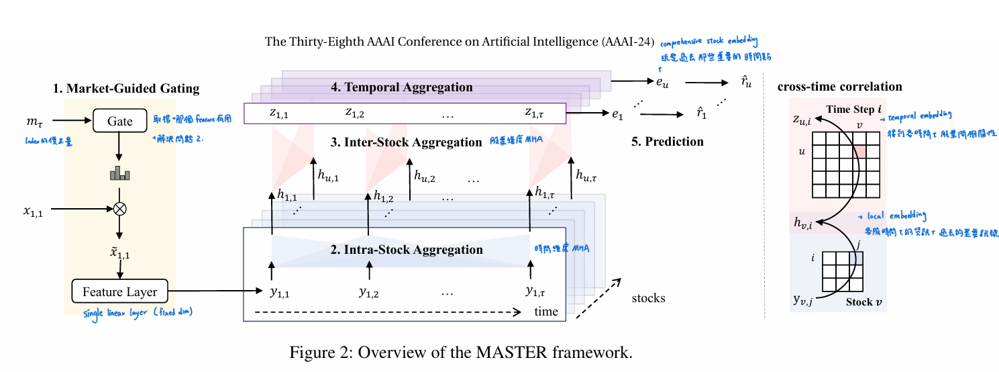

<!-- _paginate: tfalse -->

##   DLP Final Project Prposal: Market Guided Stock Transformer 
Group
10705009 陳重光、313551047 陳以瑄、313554043 戴明貴 

---
### Outline

* Intoduction
* MASTER - AAAI'24
* Motivation & Innovation
* Problem Definition

---
### Introduction
* 

---
### MASTER:Market-Guided Stock Transformer for Stock Price Forecasting [1]

<!-- _footer: '[1] <a href="https://ojs.aaai.org/index.php/AAAI/article/view/27767">MASTER:Market-Guided Stock Transformer for Stock Price Forecasting</a>' -->
---
### Motivation & Innovation

---
### Problem Definition

---
### Data Description

---
### Example of footer
MASTER:Market-Guided Stock Transformer for Stock Price Forecasting [1]

<!-- _footer: '[1] <a href="https://ojs.aaai.org/index.php/AAAI/article/view/27767">MASTER:Market-Guided Stock Transformer for Stock Price Forecasting</a>' -->

---
### Example of table
|OFTIC|ACTDATS|ESTIMID|ALYSNAM|HORIZON|VALUE|ESTCUR|
|--|--|--|--|--|--|--|
|GOOGL|2015-10-23|GOLDMAN|BELLINI, CFA H|12|42.50|USD|
|2330|2014-10-21|CSCFH|CHEN L| 3|140.000|TWD|

---
### Example of insert images

